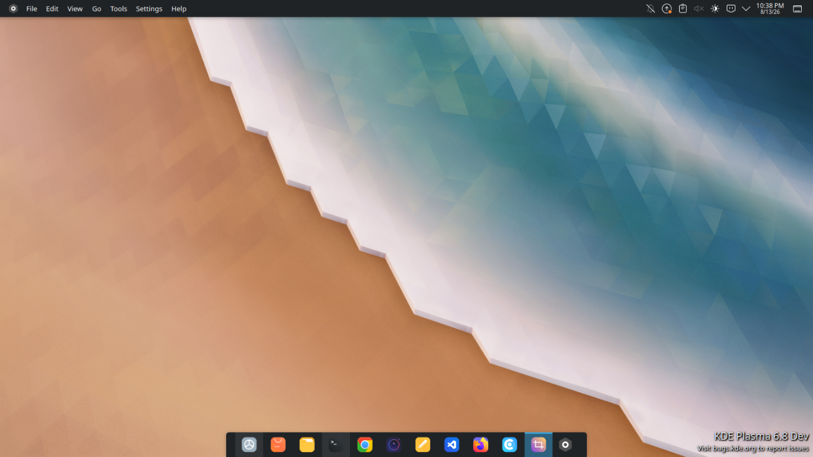
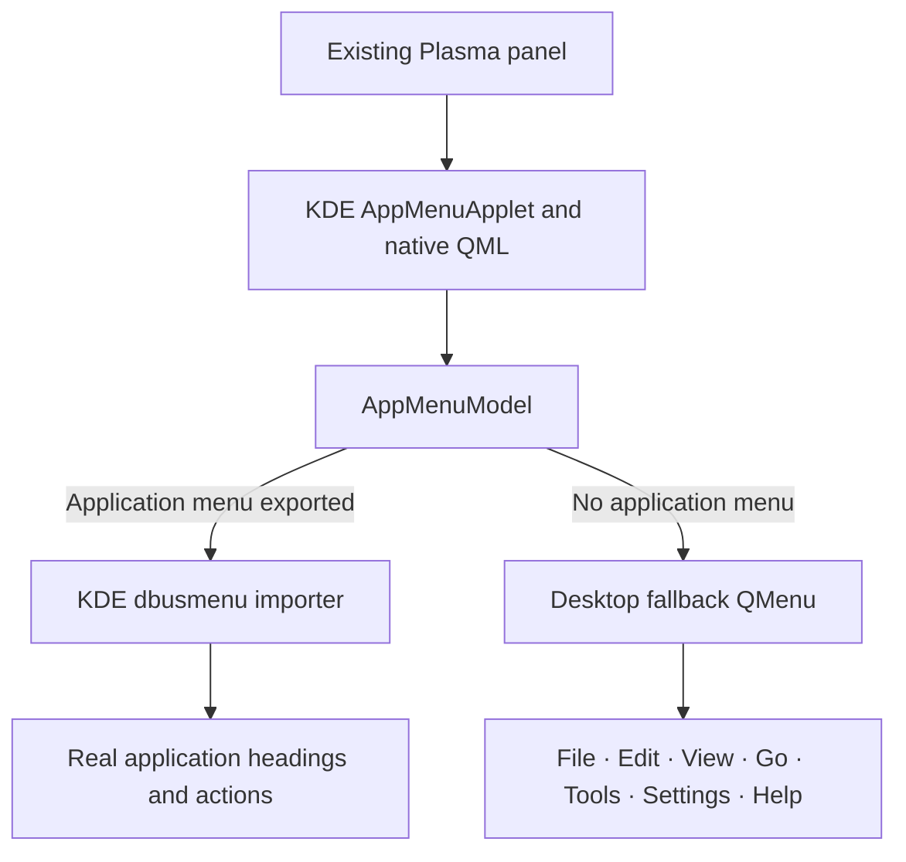

# KDE Global Menu

<p align="center">
  <strong>A native KDE Plasma 6 Global Menu applet with a useful desktop fallback.</strong>
</p>

<p align="center">
  <a href="https://github.com/ChathurangaBW/global-menu-KDE/actions/workflows/ci.yml"></a>
  
  
  
  
</p>

<p align="center">
  <a href="https://github.com/ChathurangaBW/global-menu-KDE/blob/main/docs/screenshots/full-desktop.png">
    
  </a>
</p>

<p align="center">
  <em>Click the screenshot to open the full-size image.</em>
</p>

> **One panel. Native KDE behavior. One useful fallback.**
>
> When the active application exports a menu, KDE Global Menu shows its real application menu. When no compatible menu is available, the applet automatically switches to a practical desktop menu.

## Quick navigation

- [Overview](#overview)
- [Screenshots](#screenshots)
- [Desktop fallback](#desktop-fallback)
- [Installation](#installation)
- [Architecture](#architecture)
- [Build from source](#build-from-source)
- [Quality assurance](#quality-assurance)
- [Documentation](#documentation)

## Overview

KDE Global Menu extends Plasma's native Global Menu applet without replacing its normal behavior. It stays inside your existing Plasma panel and adds a desktop fallback for the otherwise empty state.

| Plasma state | What KDE Global Menu displays |
| --- | --- |
| Desktop or no exported application menu | `File · Edit · View · Go · Tools · Settings · Help` |
| Dolphin, Kate, KWrite, or another compatible app is active | The application's real KDE global menu |
| The application closes or stops exporting its menu | The desktop fallback returns automatically |

The project does **not** create a second panel, Apple-style system bar, clock, search interface, workspace control, or status area. KDE's existing panel layout and native Global Menu interaction model remain intact.

## Screenshots

The full desktop preview is shown at the top of this page. The interactive panel-state diagram below shows how KDE Global Menu switches between a real application menu and the desktop fallback.

### Panel states

<p align="center">
  <a href="https://github.com/ChathurangaBW/global-menu-KDE/blob/main/docs/screenshots/panel-states.svg">
    
  </a>
</p>

<p align="center"><em>Click the diagram to open the original SVG.</em></p>

### Desktop File menu

<p align="center">
  <a href="https://github.com/ChathurangaBW/global-menu-KDE/blob/main/docs/screenshots/desktop-file-menu.svg">
    
  </a>
</p>

## Desktop fallback

The fallback appears only when no compatible application menu is available.

| Menu | Desktop actions |
| --- | --- |
| **File** | Create New, Restart Plasma Shell, Close Window, Force Quit Window, Lock Screen, logout prompt, default browser |
| **Edit** | Clipboard History, Desktop and Wallpaper, Display Configuration |
| **View** | Peek at Desktop, Restore Windows, Overview, Activities |
| **Go** | Home, Documents, Downloads, Trash, Root Filesystem, Network, Recent Locations |
| **Tools** | Find Files, Run Command, Terminal, System Monitor, disk usage, Partition Manager |
| **Settings** | System Settings, Power Management, Date and Time, Region and Language, Bluetooth |
| **Help** | KDE Help Center, project documentation and issues, KDE community |

Important behavior:

- **Create New** safely supports folders, text files, HTML files, URL links, links to existing files or directories, and application launchers.
- **Restart Plasma Shell** asks for confirmation and uses Plasma's systemd user service when available.
- **Close Window** requests a normal close for the active window.
- **Force Quit Window…** asks for confirmation before starting KWin's force-close action.
- Optional actions are disabled when their required executable or active-window capability is unavailable.
- As soon as a real application menu appears, KDE's normal dbusmenu-backed application menu replaces the fallback.
- Translations follow the user's existing desktop locale automatically through KDE's normal locale settings. There is no separate language selector to configure.

Desktop Undo, desktop icon arrangement, and desktop Edit Mode are intentionally not exposed because Plasma 6 does not provide stable public interfaces for those desktop-containment actions from a panel applet.

## Installation

### Recommended: portable source installer

KDE Global Menu includes a portable Plasma 6 source installer. It compiles the applet against the Qt, KDE Frameworks, and Plasma ABI installed on your system, runs the tests, audits the resulting plugin, and installs it into KDE's normal system plugin path under `/usr`.

Run the installer as your normal desktop user. **Do not prefix it with `sudo`.** It requests elevation only when dependencies or the final system installation require it.

```bash
curl -fsSL https://raw.githubusercontent.com/ChathurangaBW/global-menu-KDE/main/install.sh | bash
```

To inspect the source before installation:

```bash
git clone https://github.com/ChathurangaBW/global-menu-KDE.git
cd global-menu-KDE
bash ./install.sh
```

The installer recognizes build dependencies for `apt`, `dnf`, `pacman`, and `zypper`. On another Plasma 6 distribution, install the Qt 6, KF6, and Plasma development dependencies yourself, then run:

```bash
bash ./install.sh --no-deps
```

The installer requires KDE Plasma 6. It does not use a user-local `QT_PLUGIN_PATH` workaround and does not create a second panel.

After the first binary-plugin installation, log out of Plasma and back in once. Then open **Edit Mode → Add Widgets**, search for **KDE Global Menu**, and drag it into your existing panel.

### Native release packages

Validated [GitHub Releases](https://github.com/ChathurangaBW/global-menu-KDE/releases) provide packages for supported distribution families:

- `.deb` for compatible Debian, Ubuntu, and KDE neon systems
- `.rpm` for Fedora and compatible RPM systems
- `.pkg.tar.zst` and `PKGBUILD` for Arch Linux and AUR workflows
- `.tar.gz` for source builds on other Plasma 6 distributions

Native packages are architecture- and ABI-specific. Select the package matching both your distribution family and CPU architecture. On rolling, unstable, or otherwise ABI-mismatched Plasma installations, use the source installer so the plugin is compiled against your installed Plasma libraries.

The fallback and Wayland menu search use the current `LANG`, `LC_MESSAGES`, and KDE locale configuration. Translation catalogs are installed with the applet; when a catalog is unavailable, KDE safely falls back to English.

For dependency details, manual installation, upgrades, and legacy cleanup, see **[docs/INSTALL.md](docs/INSTALL.md)**.

### Uninstall

Every CLI installation stores its exact CMake install manifest and installs a small uninstaller:

```bash
global-menu-kde-uninstall
```

If you still have the source checkout, you can also run:

```bash
bash ./install.sh --uninstall
```

## Architecture



The implementation is based directly on Plasma Workspace's native `applets/appmenu` architecture. KDE's popup and controller behavior, active-window tracking, panel sizing, keyboard handling, hover switching, RTL behavior, and appmenu lifecycle are retained. The project-specific behavior is isolated to the **no-application-menu state**.

Read the detailed design in **[docs/ARCHITECTURE.md](docs/ARCHITECTURE.md)**.

## Build from source

Build locally with the project helper:

```bash
bash ./scripts/build.sh
```

To configure, build, and test manually:

```bash
cmake -S . -B build -G Ninja \
  -DCMAKE_BUILD_TYPE=Release \
  -DCMAKE_INSTALL_PREFIX=/usr \
  -DBUILD_TESTING=ON
cmake --build build --parallel
ctest --test-dir build --output-on-failure
```

For normal installation, prefer `bash ./install.sh`. It handles the system install, dependency audit, install-manifest persistence, legacy cleanup, and uninstaller consistently.

## Quality assurance

The CI contract checks more than rendering:

- Desktop fallback → real application menu → desktop fallback transitions
- Real dbusmenu actions and submenus
- Desktop fallback action dispatch
- Plasma restart and active-window action behavior
- Release build and CTest
- Repeated application-menu lifecycle testing
- ASan, UBSan, and D-Bus stress testing
- Staged `/usr` plugin layout and ELF dependency auditing
- Plasma discovery with `QT_PLUGIN_PATH` unset
- `plasmawindowed` smoke loading
- Native package creation, installation, discovery, and uninstallation
- Arch Linux, Fedora x86_64/aarch64, and Debian amd64/arm64 release jobs
- Reproducible source archive and checksum generation
- ShellCheck and Bash syntax validation
- End-to-end `install.sh --no-deps` installation as a non-root user
- Persistent uninstall manifest and CLI uninstall verification

Automated headless tests do not replace a real Plasma panel test. See **[docs/QA.md](docs/QA.md)** for the manual desktop matrix.

## Repository layout

```text
.
├── install.sh               portable Plasma 6 source installer
├── src/
│   ├── appmenuapplet.*      KDE native Global Menu controller
│   ├── appmenumodel.*       native model and fallback selection
│   ├── desktopfallback.*    project-specific desktop fallback
│   ├── main.xml             native Global Menu configuration
│   └── qml/                 native Global Menu presentation
├── third_party/
│   └── libdbusmenuqt/       KDE/Canonical private dbusmenu importer
├── tests/
├── scripts/
│   ├── install-system.sh
│   └── uninstall-system.sh
├── docs/
│   ├── ARCHITECTURE.md
│   ├── INSTALL.md
│   ├── QA.md
│   └── screenshots/
└── README.md
```

## Documentation

- **[Installation and upgrades](docs/INSTALL.md)**
- **[Architecture](docs/ARCHITECTURE.md)**
- **[QA validation](docs/QA.md)**
- **[Panel state switching](docs/screenshots/panel-states.svg)**
- **[Desktop File menu](docs/screenshots/desktop-file-menu.svg)**
- **[Latest release](https://github.com/ChathurangaBW/global-menu-KDE/releases/latest)**
- **[Issue tracker](https://github.com/ChathurangaBW/global-menu-KDE/issues)**

## Upstream and licensing

The native applet portions are derived from KDE Plasma Workspace's Global Menu applet and retain KDE's original SPDX copyright and license declarations. The vendored `libdbusmenuqt` files retain their Canonical/KDE `LGPL-2.0-or-later` declarations. Project-specific fallback code uses `GPL-2.0-or-later`.

See [`LICENSE`](LICENSE) and each source file's SPDX header for the authoritative license terms.
