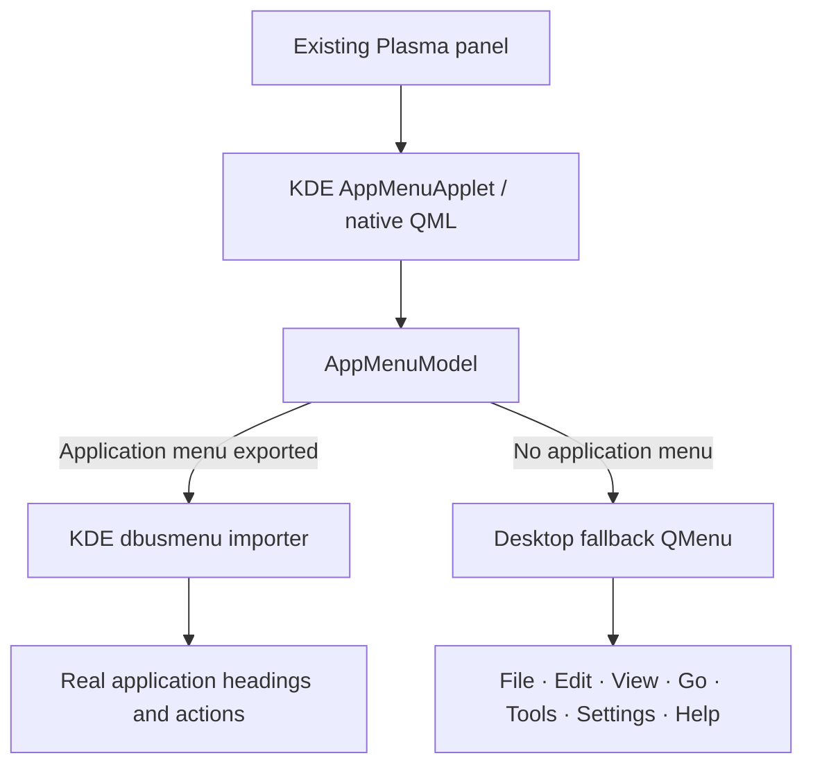

# Global Menu KDE

<p align="center">
  <strong>KDE Plasma's native Global Menu applet, with the missing desktop menu state added.</strong>
</p>

<p align="center">
  <a href="https://github.com/ChathurangaBW/global-menu-KDE/actions/workflows/ci.yml"></a>
  
  
  
  
</p>

<p align="center">
  
</p>

## Full desktop screenshot

<p align="center">
  
</p>

> **One panel. Native KDE behavior. One added state.**  
> When no application exports a global menu, the applet shows a useful desktop fallback. When Dolphin, Kate, KWrite, or another compatible application becomes active, KDE's normal exported application menu takes over automatically.

## What it does

| Plasma state | What Global Menu KDE shows |
| --- | --- |
| Desktop / no exported application menu | `File   Edit   View   Go   Tools   Settings   Help` |
| Dolphin/Kate/KWrite/etc. exports a menu | The application's **real KDE global menu** |
| Application closes / stops exporting | Desktop fallback returns automatically |

This project does **not** create a second panel, an Apple-style system bar, a clock, workspace controls, search, or status widgets. It stays inside the user's existing Plasma panel and preserves KDE's native Global Menu interaction model.

## Desktop fallback preview

<p align="center">
  
</p>

The desktop fallback contains useful Plasma actions only while no compatible application menu is available:

| Menu | Desktop actions |
| --- | --- |
| **File** | Home Folder, Documents, Downloads, Trash |
| **Edit** | Clipboard History |
| **View** | Show Desktop, Restore Windows |
| **Go** | Home, Documents, Downloads, Trash |
| **Tools** | Run Command, Konsole, System Monitor |
| **Settings** | System Settings |
| **Help** | KDE Help Center |

As soon as a real application menu appears, this fallback is removed from the presentation and KDE's normal dbusmenu-backed application menu is shown instead.

## Architecture



The implementation is based directly on Plasma Workspace's native `applets/appmenu` architecture. KDE's popup/controller behavior, active-window tracking, panel sizing, keyboard handling, hover switching, RTL behavior, and appmenu lifecycle are retained. The project-specific change is isolated to the **no-application-menu state**.

Read the detailed design: **[docs/ARCHITECTURE.md](docs/ARCHITECTURE.md)**.

## Install on KDE neon / Ubuntu-family Plasma 6

Install the build dependencies:

```bash
sudo apt update
sudo apt install \
  git build-essential cmake ninja-build extra-cmake-modules \
  qt6-base-dev qt6-declarative-dev \
  libkf6config-dev libkf6i18n-dev libkf6windowsystem-dev \
  libplasma-dev plasma-workspace-dev
```

Clone and install into KDE's normal system plugin location:

```bash
git clone https://github.com/ChathurangaBW/global-menu-KDE.git
cd global-menu-KDE
bash ./scripts/install-system.sh
```

Then log out of Plasma and back in once. Open **Edit Mode → Add Widgets**, search for **Global Menu KDE**, and drag it **directly into your existing panel**, exactly like KDE's native Global Menu widget.

The current rewrite installs under `/usr`; it does **not** depend on the old `~/.local` + `QT_PLUGIN_PATH` development workaround.

For manual build, upgrades, legacy-cleanup notes, and uninstall instructions, see **[docs/INSTALL.md](docs/INSTALL.md)**.

## Build

Build locally with one command:

```bash
bash ./scripts/build.sh
```

To install it system-wide after a successful build:

```bash
bash ./scripts/install-system.sh
```

To configure, build, and test manually:

```bash
cmake -S . -B build -G Ninja \
  -DCMAKE_BUILD_TYPE=Release \
  -DCMAKE_INSTALL_PREFIX=/usr \
  -DBUILD_TESTING=ON
cmake --build build --parallel
ctest --test-dir build --output-on-failure
sudo cmake --install build
kbuildsycoca6 --noincremental
```

## Release packages

The production pipeline is designed to publish native packages only after package-specific install and Plasma smoke tests pass:

| Package | Distribution family | Architectures |
| --- | --- | --- |
| `.deb` | Debian / Ubuntu / KDE neon compatible Plasma 6 systems | `amd64`, `arm64` |
| `.rpm` | Fedora / compatible Plasma 6 RPM systems | `x86_64`, `aarch64` |
| `.pkg.tar.zst` | Official Arch Linux | `x86_64` |
| `.tar.gz` | Source | architecture-independent |

**Release integrity rule:** a GitHub Release is not considered production-ready until its downloadable assets and `SHA256SUMS` are actually present and their package jobs are green. If a release page is empty or incomplete, use the source installation above rather than treating that release as valid.

## QA philosophy

Rendering the menu is not enough. The release contract checks behavior across the full lifecycle:

- desktop fallback → real application menu → desktop fallback;
- real dbusmenu direct actions and submenus;
- desktop fallback action dispatch;
- Release build + CTest;
- sanitizer and repeated integration runs;
- native `/usr` plugin installation;
- Plasma discovery with `QT_PLUGIN_PATH` unset;
- `plasmawindowed` smoke loading;
- package install/uninstall checks;
- unresolved ELF dependency rejection;
- native package validation before release publication.

The complete automated and manual matrix is documented in **[docs/QA.md](docs/QA.md)**.

## Repository layout

```text
.
├── src/
│   ├── appmenuapplet.*       KDE native Global Menu controller
│   ├── appmenumodel.*        KDE native model + fallback selection
│   ├── desktopfallback.*     project-specific desktop fallback
│   ├── main.xml              native Global Menu configuration
│   └── qml/                  KDE native Global Menu presentation
├── third_party/
│   └── libdbusmenuqt/        KDE/Canonical private dbusmenu importer
├── tests/
│   ├── desktopfallbacktest.cpp
│   └── appmenumodeltest.cpp
├── scripts/
│   ├── install-system.sh
│   └── uninstall-system.sh
├── docs/
│   ├── ARCHITECTURE.md
│   ├── INSTALL.md
│   ├── QA.md
│   └── screenshots/
└── README.md
```

## Documentation

- **[Installation and upgrades](docs/INSTALL.md)**
- **[Architecture](docs/ARCHITECTURE.md)**
- **[QA and release validation](docs/QA.md)**
- **[Visual: panel state switching](docs/screenshots/panel-states.svg)**
- **[Visual: desktop File menu](docs/screenshots/desktop-file-menu.svg)**

## Upstream and licensing

The native applet portions are derived from KDE Plasma Workspace's Global Menu applet and retain KDE's original SPDX copyright/license declarations. The vendored `libdbusmenuqt` files retain their Canonical/KDE `LGPL-2.0-or-later` declarations. Project-specific fallback code uses `GPL-2.0-or-later`.

See `LICENSE` and each source file's SPDX header for the authoritative license terms.
