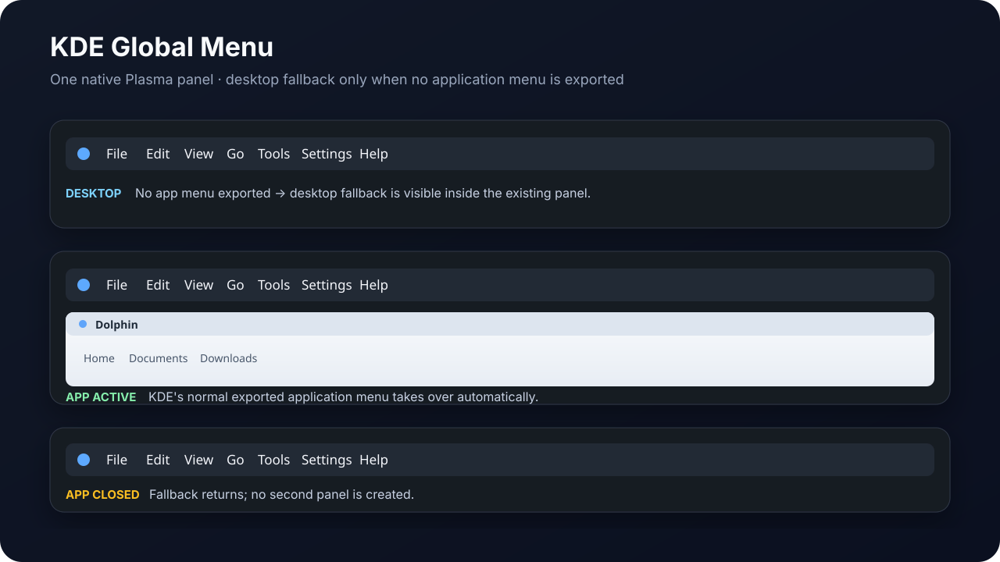
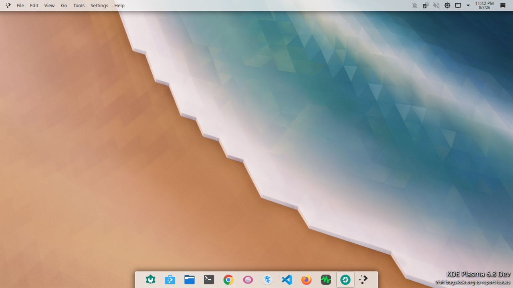
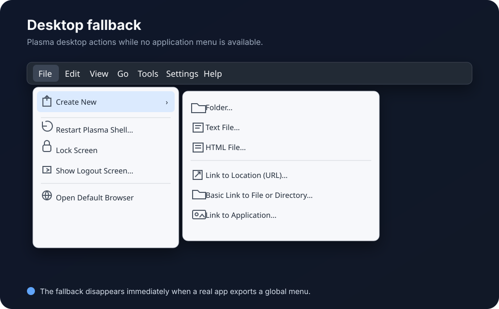
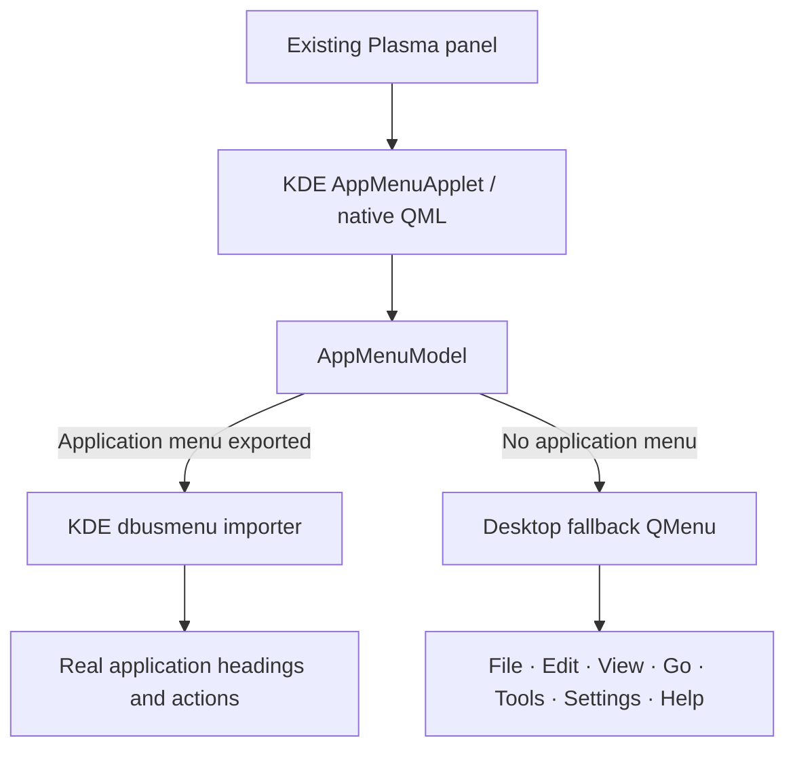

# Global Menu KDE

<p align="center">
  <strong>KDE Plasma's native Global Menu applet, with the missing desktop menu state added.</strong>
</p>

<p align="center">
  <a href="https://github.com/ChathurangaBW/global-menu-KDE/actions/workflows/ci.yml"></a>
  
  
  
  
</p>

<p align="center">
  
</p>

## Full desktop screenshot

<p align="center">
  
</p>

> **One panel. Native KDE behavior. One added state.**  
> When no application exports a global menu, the applet shows a useful desktop fallback. When Dolphin, Kate, KWrite, or another compatible application becomes active, KDE's normal exported application menu takes over automatically.

## What it does

| Plasma state | What Global Menu KDE shows |
| --- | --- |
| Desktop / no exported application menu | `File   Edit   View   Go   Tools   Settings   Help` |
| Dolphin/Kate/KWrite/etc. exports a menu | The application's **real KDE global menu** |
| Application closes / stops exporting | Desktop fallback returns automatically |

This project does **not** create a second panel, an Apple-style system bar, a clock, workspace controls, search, or status widgets. It stays inside the user's existing Plasma panel and preserves KDE's native Global Menu interaction model.

## Desktop fallback preview

<p align="center">
  
</p>

The desktop fallback contains useful Plasma actions only while no compatible application menu is available:

| Menu | Desktop actions |
| --- | --- |
| **File** | Home Folder, Documents, Downloads, Trash |
| **Edit** | Clipboard History |
| **View** | Show Desktop, Restore Windows |
| **Go** | Home, Documents, Downloads, Trash |
| **Tools** | Run Command, Konsole, System Monitor |
| **Settings** | System Settings |
| **Help** | KDE Help Center |

As soon as a real application menu appears, this fallback is removed from the presentation and KDE's normal dbusmenu-backed application menu is shown instead.

## Architecture



The implementation is based directly on Plasma Workspace's native `applets/appmenu` architecture. KDE's popup/controller behavior, active-window tracking, panel sizing, keyboard handling, hover switching, RTL behavior, and appmenu lifecycle are retained. The project-specific change is isolated to the **no-application-menu state**.

Read the detailed design: **[docs/ARCHITECTURE.md](docs/ARCHITECTURE.md)**.

## Install

Global Menu KDE is distributed as a **portable Plasma 6 source installer**, not as a distro-specific binary package. The installer compiles the applet against the Qt/KF6/Plasma ABI already installed on the machine, runs the tests, audits the resulting plugin, and installs it into KDE's normal system plugin path under `/usr`.

Run as your normal desktop user — **do not prefix the command with `sudo`**. The installer requests elevation only for dependency installation and the final system install.

### One-command install

```bash
curl -fsSL https://raw.githubusercontent.com/ChathurangaBW/global-menu-KDE/main/install.sh | bash
```

For an inspectable installation, clone first:

```bash
git clone https://github.com/ChathurangaBW/global-menu-KDE.git
cd global-menu-KDE
bash ./install.sh
```

`install.sh` currently knows the build dependency names for `apt`, `dnf`, `pacman`, and `zypper`. On another Plasma 6 distribution, install the required Qt 6 / KF6 / Plasma development dependencies yourself and run:

```bash
bash ./install.sh --no-deps
```

The installer requires KDE Plasma 6. It does not use a user-local `QT_PLUGIN_PATH` workaround and does not create a second panel.

After the first binary-plugin installation, log out of Plasma and back in once. Then open **Edit Mode → Add Widgets**, search for **Global Menu KDE**, and drag it directly into the existing panel.

### Uninstall

Every CLI installation stores its exact CMake install manifest and installs a small uninstaller:

```bash
global-menu-kde-uninstall
```

If you still have the source checkout, this also works:

```bash
bash ./install.sh --uninstall
```

For dependency details, manual build commands, upgrades, and legacy-cleanup notes, see **[docs/INSTALL.md](docs/INSTALL.md)**.

## Distribution model

Validated GitHub Releases provide native packages for supported distribution families:

- `.deb` for Debian, Ubuntu, and KDE neon systems;
- `.rpm` for Fedora and compatible RPM systems;
- `.pkg.tar.zst` plus `PKGBUILD` for Arch Linux and AUR workflows;
- `.tar.gz` for source builds on other Plasma 6 distributions.

Native packages are architecture- and ABI-specific. Use the package matching both your distribution family and CPU architecture. The source installer remains available when a native package is not suitable.

## Build

Build locally with one command:

```bash
bash ./scripts/build.sh
```

To configure, build, and test manually:

```bash
cmake -S . -B build -G Ninja \
  -DCMAKE_BUILD_TYPE=Release \
  -DCMAKE_INSTALL_PREFIX=/usr \
  -DBUILD_TESTING=ON
cmake --build build --parallel
ctest --test-dir build --output-on-failure
```

For normal installation, prefer `bash ./install.sh` so the system install, dependency audit, manifest persistence, legacy cleanup, and uninstaller are handled consistently.

## QA

The CI contract checks more than rendering:

- desktop fallback → real application menu → desktop fallback;
- real dbusmenu direct actions and submenus;
- desktop fallback action dispatch;
- Release build + CTest;
- repeated application-menu lifecycle testing;
- staged `/usr` plugin layout and ELF dependency audit;
- Plasma discovery with `QT_PLUGIN_PATH` unset;
- `plasmawindowed` smoke loading;
- ShellCheck and Bash syntax validation;
- end-to-end `install.sh --no-deps` installation as a non-root user;
- persistent uninstall manifest and CLI uninstall verification.

Automated headless tests do not replace a real Plasma panel test. See **[docs/QA.md](docs/QA.md)** for the manual desktop matrix.

## Repository layout

```text
.
├── install.sh               portable Plasma 6 source installer
├── src/
│   ├── appmenuapplet.*      KDE native Global Menu controller
│   ├── appmenumodel.*       KDE native model + fallback selection
│   ├── desktopfallback.*    project-specific desktop fallback
│   ├── main.xml             native Global Menu configuration
│   └── qml/                 KDE native Global Menu presentation
├── third_party/
│   └── libdbusmenuqt/       KDE/Canonical private dbusmenu importer
├── tests/
├── scripts/
│   ├── install-system.sh
│   └── uninstall-system.sh
├── docs/
│   ├── ARCHITECTURE.md
│   ├── INSTALL.md
│   ├── QA.md
│   └── screenshots/
└── README.md
```

## Documentation

- **[Installation and upgrades](docs/INSTALL.md)**
- **[Architecture](docs/ARCHITECTURE.md)**
- **[QA validation](docs/QA.md)**
- **[Visual: panel state switching](docs/screenshots/panel-states.svg)**
- **[Visual: desktop File menu](docs/screenshots/desktop-file-menu.svg)**

## Upstream and licensing

The native applet portions are derived from KDE Plasma Workspace's Global Menu applet and retain KDE's original SPDX copyright/license declarations. The vendored `libdbusmenuqt` files retain their Canonical/KDE `LGPL-2.0-or-later` declarations. Project-specific fallback code uses `GPL-2.0-or-later`.

See `LICENSE` and each source file's SPDX header for the authoritative license terms.
