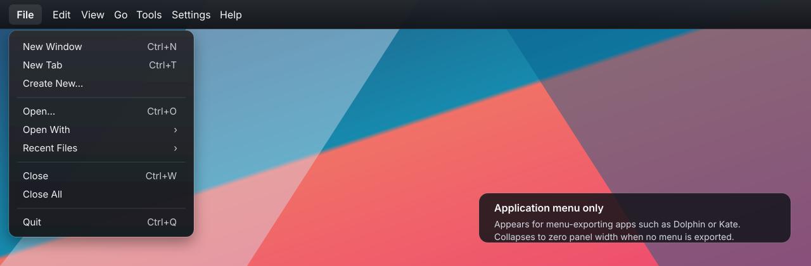

# Global Menu KDE

[](https://github.com/ChathurangaBW/global-menu-KDE/actions/workflows/ci.yml)


A KDE Plasma 6 **Global Menu applet for an existing Plasma panel** with a desktop fallback menu.

When no application exports a global menu, the applet stays visible as:

```text
File   Edit   View   Go   Tools   Settings   Help
```

When Dolphin, Kate, KWrite, or another compatible application becomes active, that desktop fallback is automatically replaced by the application's **real exported menu**.

This project does **not** create a second panel and it does not implement a full macOS top bar. It is one Global Menu applet that lives inside the panel you already have.

<p align="center">
  
</p>

## Behavior

| Situation | What the applet shows |
| --- | --- |
| Plasma desktop / no compatible application menu | Desktop fallback: **File Edit View Go Tools Settings Help** |
| Dolphin/Kate/KWrite exports a menu | That application's real menu headings |
| Active application changes | Menu switches to the newly active application's exported menu |
| Export disappears or application closes | Desktop fallback returns |
| Applet is placed in a Plasma panel | Compact menu text only; the applet requests **no separate background** |

## Desktop fallback menus

The fallback is not a fake application menu. It exposes desktop-level Plasma actions:

- **File** — Home Folder, Documents, Downloads, Trash
- **Edit** — Clipboard History
- **View** — Show Desktop, Restore Windows
- **Go** — Home, Documents, Downloads, Trash
- **Tools** — Run Command, Konsole, System Monitor
- **Settings** — System Settings
- **Help** — KDE Help Center

When a real application menu is available, these fallback menus disappear and the application's own `dbusmenu` hierarchy takes over.

## What is deliberately not included

- No Apple/system menu.
- No second Plasma panel.
- No application launcher.
- No clock/calendar.
- No workspace switcher.
- No media/status area.
- No synthetic replacement for an application's real menu when one is exported.

---

## Installation

### Build from source — recommended for KDE neon and other non-Arch systems

```bash
git clone https://github.com/ChathurangaBW/global-menu-KDE.git
cd global-menu-KDE
bash ./scripts/install-user.sh
```

The installer:

1. Configures a Release build.
2. Compiles the applet.
3. Runs the lightweight unit/AppStream tests.
4. Skips the private-D-Bus integration harness during normal live installation so KDE neon/unstable cannot hang on test teardown.
5. Installs under `~/.local` by default.
6. Creates the Plasma-session `QT_PLUGIN_PATH` hook needed for the compiled applet plugin.

To explicitly run the integration test during installation:

```bash
RUN_INTEGRATION_TESTS=1 bash ./scripts/install-user.sh
```

After installation, **log out and log back in**, then add **Global Menu KDE** to your existing Plasma panel.

Remove KDE's stock **Global Menu** widget if both are present.

Full details: **[docs/INSTALL.md](docs/INSTALL.md)**.

### Prebuilt GitHub Actions artifact

Every successful CI run publishes `global-menu-kde-plasma6` containing:

- the compiled Plasma applet;
- `install.sh`;
- `uninstall.sh`;
- README and documentation.

The prebuilt binary is compiled on current Arch Linux x86-64. Other distributions should normally build from source to match their Qt/KF6/Plasma ABI.

---

## Requirements

| Component | Requirement |
| --- | --- |
| Desktop | KDE Plasma 6 |
| Qt | Qt 6.6+ |
| KDE Frameworks | KF6 |
| Build system | CMake + Extra CMake Modules |
| Active-window integration | Plasma Workspace `LibTaskManager` |
| Session | Wayland or X11 |

CI currently builds with current Arch Linux packages including `qt6-base`, `qt6-declarative`, `kconfig`, `kcoreaddons`, `ki18n`, `kwindowsystem`, `libplasma`, and `plasma-workspace`.

---

## Architecture

```text
                    ┌───────────────────────────────┐
                    │       DisplayMenuModel        │
                    │                               │
                    │ app menu available?           │
                    │   yes ───────────────┐        │
                    │   no  ── desktop ─┐  │        │
                    └────────────────────┼──┼────────┘
                                         │  │
                    desktop fallback ◄───┘  │
                                            ▼
Active application ──► KDE AppMenu registrar ──► GlobalMenuModel
                                            │
                                            ▼
                                      QAction / QMenu
                                            │
                                            ▼
                                      GlobalMenuApplet
                                            │
                                            ▼
                               existing Plasma panel surface
```

### Application menu path

1. `LibTaskManager` tracks the active application.
2. KDE provides `com.canonical.AppMenu.Registrar`.
3. The applet reads the active window's menu service/object path.
4. `GlobalMenuModel` imports `com.canonical.dbusmenu` with `GetLayout`.
5. Menu clicks are returned to the application through `Event`.

### Desktop fallback path

When no usable exported application menu exists, `DisplayMenuModel` serves seven local top-level menus instead. As soon as a real application menu becomes available, the display model resets to the real menu automatically.

The project does **not** take ownership of `com.canonical.AppMenu.Registrar`; KDE already owns that integration point.

More details: **[docs/ARCHITECTURE.md](docs/ARCHITECTURE.md)**.

---

## Panel presentation

The applet is intentionally compact:

- `Plasmoid.backgroundHints: NoBackground`
- no `CanFillArea` constraint
- width follows the menu content
- KDE menubar hover/pressed styling is used only on individual menu items

So the menu should appear as part of the **existing Plasma panel**, not as the wide standalone dark rectangle shown by the earlier incorrect implementation.

---

## dbusmenu support

For real application menus, the importer handles:

- `GetLayout`
- `AboutToShow`
- `opened`, `closed`, and `clicked`
- submenus
- disabled actions
- check/radio actions
- icons and raw `icon-data`
- exported shortcuts
- incremental `ItemsPropertiesUpdated`
- structural fallback reloads
- stale asynchronous-reply protection when the active application changes

---

## Build and QA

```bash
cmake -S . -B build \
    -DCMAKE_BUILD_TYPE=Release \
    -DBUILD_TESTING=ON
cmake --build build --parallel
ctest --test-dir build --output-on-failure
```

Static repository QA:

```bash
bash ./scripts/qa.sh --static
```

Full QA:

```bash
bash ./scripts/qa.sh
```

The integration test verifies:

- seven desktop fallback headings when no app menu exists;
- automatic application takeover when a dbusmenu appears;
- return to the fallback when the app menu disappears;
- real dbusmenu layout/action/lifecycle behavior.

Detailed QA matrix: **[docs/QA.md](docs/QA.md)**.

---

## Troubleshooting

### KDE neon / unstable installer appeared to stop at `dbusmenumodel_test`

Pull current `main` and run the installer again:

```bash
git pull --ff-only
bash ./scripts/install-user.sh
```

Normal installation no longer waits on that private-D-Bus integration harness. CI/full QA still runs it with a hard timeout.

### Widget shows as a separate large desktop rectangle

Use **Global Menu KDE inside a Plasma panel**. Current QML also requests `NoBackground` and no fill-area behavior, so it does not create its own panel surface.

### Desktop fallback is visible even with no application open

That is the intended behavior.

### Dolphin/Kate becomes active

The fallback should be replaced by Dolphin/Kate's real menu. If it is not, see **[docs/QA.md](docs/QA.md)** for registrar/dbus checks.

### Two global menus are visible

Remove KDE's stock **Global Menu** widget and keep **Global Menu KDE**.

---

## Uninstall

Source install:

```bash
bash ./scripts/uninstall-user.sh
```

Then log out and log back in.

---

## Repository layout

```text
.
├── src/
│   ├── globalmenumodel.*       real application dbusmenu importer
│   ├── displaymenumodel.*      desktop fallback + app-menu switch
│   ├── globalmenuapplet.*      popup/panel controller
│   └── qml/                    compact panel UI
├── tests/                      Qt + fake dbusmenu integration tests
├── scripts/                    build/install/QA helpers
├── docs/
│   ├── global-menu-preview.svg
│   ├── INSTALL.md
│   ├── QA.md
│   └── ARCHITECTURE.md
├── TODO.md
└── README.md
```

## Documentation

- **[Installation](docs/INSTALL.md)**
- **[QA](docs/QA.md)**
- **[Architecture](docs/ARCHITECTURE.md)**
- **[Development checklist](TODO.md)**

## License

GPL-2.0-or-later. Individual source files contain SPDX identifiers.
